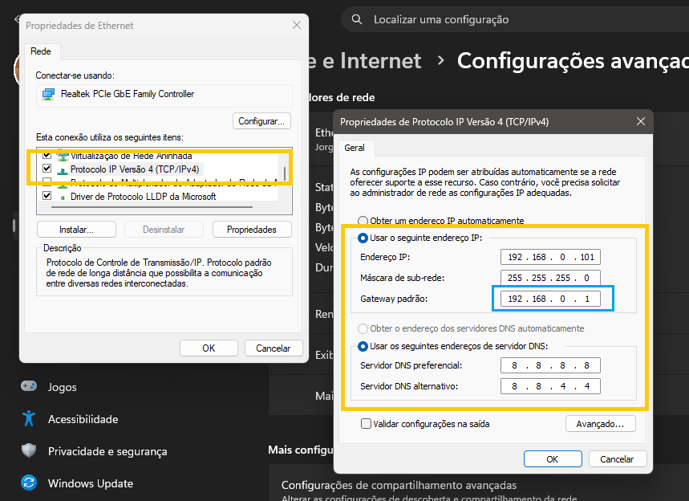

# Acompanhamento Pedagógico

--

## Índice
- [Instruções preliminares](#instruções-preliminares)
- [Instalação](#instalação)
- [Cadastros](#cadastros)
    - [Educador](#educador)
    - [Coordenador](#coordenador)
    - [Secretário](#secretário)
    - [Aluno](#aluno)
    - [Curso/Formação](#cursoformação)
- [Acompanhamento](#acompanhamento)
    - [Matérias](#matérias)
    - [Aulas](#aulas)
- [Carregamento de planilhas](#carregamento-de-planilhas)
    - [Planilha de acompanhamento Pedagógico](#planilha-de-acompanhamento-pedagógico)
    - [Planilha de controle gerada pelo Hub](#planilha-de-controle-gerada-pelo-hub)
    - [Geração de planilha de acompanhamento pedagógico](#geração-de-planilha-de-acompanhamento-pedagógico)
- [GitHub](#github)
- [Backup](#backup)
- [Solução de problemas](#solução-de-problemas)


## Instruções preliminares

Educadores e coordenadores podem utilizar este app para fazer o acompanhamento pedagógico fácil de seus alunos com os dados obtidos do sistema MoveEdu. Antes de tudo é preciso saber:

1. Configure uma forma de backup para os dados de seus alunos.

2. Em caso de formatação sem backup do computador você pode recuperar os dados do backup bem como a própria aplicação da conta GitHub da escola. Para tanto veja a sessão GitHub dessa página.

---

## Instalação

A instalação é feita em quatro passos simples:

1. Baixar a pasta compacta .zip diretamente do GitHub da Prepara (não precisa de senha).
2. Descompactar dentro da pasta Documentos.
4. Instalar o serviço.
5. Renomear o computador e copiar o link.

A seguir o passo a passo para a instalação do app para quem já utilizou e teve de formatar o computador:

### Se você formatou o computador:

1. Baixe novamente a aplicação em:

https://github.com/Prepara-Cursos-LEM/pedagogico_acompanhamento/main/app.zip

2. Descompacte dentro da pasta Documentos.

3. Abra o aplica

4. Renomeie o computador:

No Windows 10 ou 11:

1. Pressione `Win + R`.
2. Digite:

```text
sysdm.cpl
```

3. Vá para a aba **Nome do Computador**.
4. Clique em **Alterar...**
5. Em **Nome do computador**, digite:

```text
COORDENACAO
```

6. Clique em **OK**.
7. Reinicie o computador.

5. Copie a URL:

http://COORDENACAO:9123

A seguir o passo a passo para a instalação do app para quem está utilizando pela primeira vez:

1. Configuração da rede:
* Abra o CMD e digite: `ipconfig`
* Anote o valor do Gateway Padrão.
* Acesse as configurações do computador e vá até:
    → Rede e Internet
    → Configurações de avançadas de rede
    → Ethernet
    → Mais opções do adaptador: Editar
* Desça a lista e clique duas vezez em *Protocolo IP versão 4 (IPv4)*
* Configure como mostra a seguir:



* Use o Gateway Padrão anotado anteriormente.

2. Instale a aplicação.
3. Acesse http://192.168.0.101:9123, em todos os computadores que devem utilizar a aplicação.
4. Favorite o site em todos os navegadores.
5. Faça login com a senha Prepara12!
6. Se for coordenador, altere as senhas na sessão de perfil e cadastro de usuários no menu principal.

---

## Cadastros


### Educador

A

### Coordenador

A

### Secretaria

A

### Aluno

A

### Curso/Formação

A

---

## Acompanhamento

### Matérias

A

### Aulas

A

### Apostilas

A


---

## Carregamento de planilhas

A

### Planilha de acompanhamento Pedagógico

A

### Planilha de controle gerada pelo Hub

A

### Geração de planilha de acompanhamento pedagógico

A

---

## GitHub

A

---

## Backup

A

---

## Ajuda

A

### Comparação de Acompanhamentos

### Situação: SEM PROJEÇÃO e NÃO COMPUTÁVEL

### Margem de tolerância e Taxa de atualização

### Margem de Projeção

### Aliases de Cabeçalhos

---

## Solução de problemas

Educadores e coordenadores podem utilizar este app para fazer o acompanhamento pedagógico fácil de seus alunos com os dados obtidos do sistema MoveEdu. Antes de tudo é preciso saber:

1. Configure uma forma de backup para os dados de seus alunos.

2. Em caso de formatação sem backup do computador você pode recuperar os dados do backup bem como a própria aplicação da conta GitHub da escola. Para tanto veja a sessão GitHub dessa página.

---